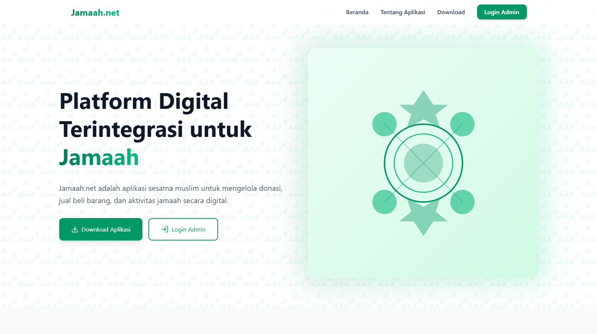
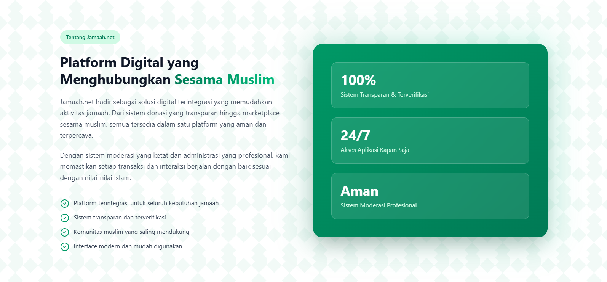
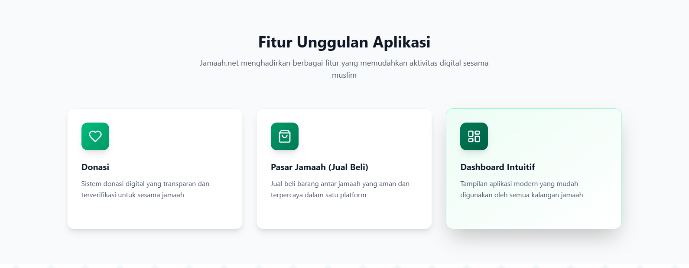

# 🕌 Jamaah.net - Platform Digital Terintegrasi



> **Solusi digital terintegrasi yang menghubungkan sesama muslim untuk mengelola donasi, jual beli, dan aktivitas jamaah secara digital.**

---

## 📖 Tentang Aplikasi

**Jamaah.net** hadir sebagai ekosistem digital yang memudahkan aktivitas umat. Web ini berfungsi ganda sebagai:

1.  **Landing Page Publik**: Memperkenalkan fitur aplikasi kepada calon pengguna.
2.  **Admin Dashboard**: Pusat kontrol untuk moderator/admin dalam mengelola member, konten, dan donasi.



---

## ✨ Fitur Unggulan

Platform ini dirancang dengan fitur-fitur modern untuk kebutuhan komunitas:

### 1. 💚 Manajemen Donasi

Sistem donasi digital yang transparan. Admin dapat memverifikasi program donasi dan memantau dana terkumpul secara real-time.

### 2. 🛍️ Pasar Jamaah (Marketplace)

Wadah jual beli antar jamaah yang aman dan terpercaya untuk mendukung ekonomi umat.

### 3. 🛡️ Dashboard Admin (Moderasi)

Fitur lengkap untuk pengelola komunitas:

- **Member Approval**: Validasi pendaftaran member baru.
- **Content Review**: Moderasi postingan timeline sebelum tayang (Approve/Reject).
- **Jadwal Kegiatan**: Manajemen agenda masjid.
- **Artikel**: Publikasi konten edukasi Islam.



---

## 🛠️ Tech Stack

Project ini dibangun menggunakan teknologi terkini untuk performa maksimal:

- **Frontend**: [React](https://react.dev/) + [Vite](https://vitejs.dev/) (TypeScript)
- **Styling**: [Tailwind CSS](https://tailwindcss.com/) + Magic UI
- **Backend/DB**: [Supabase](https://supabase.com/) (PostgreSQL + Auth)
- **Icons**: [Lucide React](https://lucide.dev/)

---

## 💻 Panduan Instalasi & Pengembangan

Ikuti langkah-langkah berikut untuk menjalankan project di komputer lokal (Localhost):

### 1. Clone Repository

Unduh source code ke komputer Anda:

```bash
git clone [https://github.com/username-kamu/jamaah-net-landing.git](https://github.com/username-kamu/jamaah-net-landing.git)
cd jamaah-net-landing
```

### 2. Install Dependencies

Pastikan Node.js sudah terinstall, lalu jalankan perintah ini untuk menginstall library yang dibutuhkan:

```bash
npm install
```

### 3. Server Development

Jalankan perintah berikut untuk menyalakan server lokal:

```bash
npm run dev
```

## 🤝 Tim Pengembang

Project ini dikembangkan dengan ❤️ untuk kemajuan umat oleh:

Ale - Lead Developer & Frontend Developer
Faiz - UI/UX & Backend Logic

© 2026 Jamaah.net
